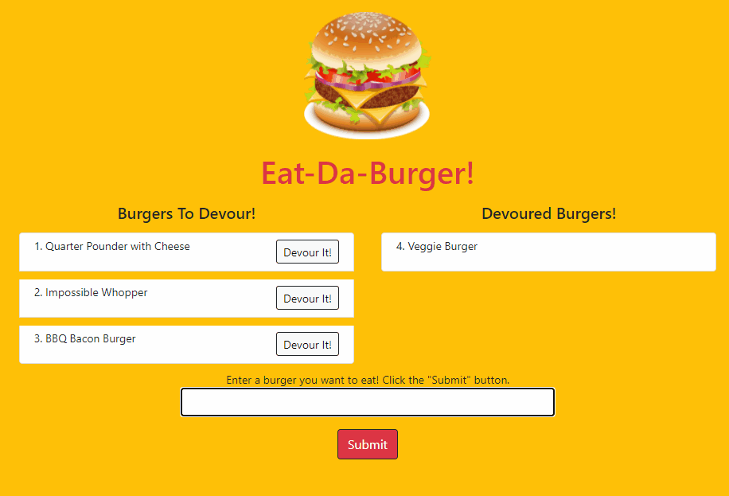

# Bootcamp Homework 13 - Node Express Handlebars: Eat-Da-Burger!

## Description
This is a coding bootcamp homework assignment to create a "burger logger" with MySQL, Node, Exress, Handlebars, and a homemade ORM. The application, deployed on Heroku, allows a user to update a list of burgers to eat, and then track eaten burgers.  It uses an express backend and retrieves burger data from a MySQL database.

## Table of Contents
* [Usage](#Usage)
* [Contributing](#Contributing)
* [Questions](#Questions)
* [License](#License)

## Usage
The [Eat-Da-Burger!](https://whispering-thicket-86767.herokuapp.com/) application runs in the browser.

Enter a burger you want to eat and click the "Submit" button.  Click the "Devour It!" button to add a burger to the "Devoured Burgers!" list

## Contributing
Fork the repo and submit a pull request to enhance the code or fix a bug

## Questions
Have questions?  Contact me on [GitHub](https://github.com/thorgriffs) or email <22.kelliking@gmail.com>

## License

[MIT](https://github.com/thorgriffs/burger/blob/main/LICENSE) License

Copyright (c) 2021 Kelli King